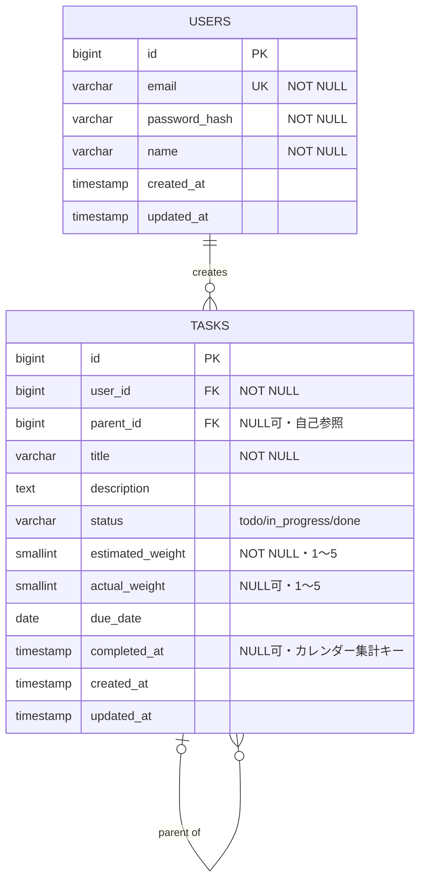

# devops-camp バックエンド 設計意図

DevOpsキャンプ最終課題のバックエンド実装。このファイルは、実装に至るまでの設計判断とその理由をまとめたもの。コードやAPI仕様書・DB仕様書だけでは読み取れない「なぜこの形にしたか」を残すために書いている。

## 最終課題の全体像

参考: https://devopscamp.reheartcloud.com/final-challenge/app/overview

自分で企画したアプリケーションを、テーマ選定からバックエンド・フロントエンド開発、クラウドへのデプロイ、DevOpsの一連の仕組み(CI/CD・コンテナ化等)まで一気通貫で作り上げる約6ヶ月(24週間)のコース。全12ステップで構成される。

| Step | 内容 | 位置づけ |
|---|---|---|
| 1 | バックエンド1 | テーマ選定・機能ドラフト作成、使用言語(Go)決定 |
| 2 | バックエンド2 | API仕様書・DB仕様書・ER図の作成 |
| 3 | バックエンド実装 | 仕様書に基づきバックエンドを実装、ローカルで動作確認 |
| 4 | フロントエンド1 | フロントエンド技術の学習 |
| 5 | フロントエンド2 | 画面設計 |
| 6 | フロントエンド実装 | フロントエンドの実装 |
| 7 | インフラ1 | クラウドインフラの学習・設計 |
| 8 | インフラ2 | アプリケーションをクラウドインフラへ展開 |
| 9 | コンテナ1 | コンテナ化の学習 |
| 10 | コンテナ2 | コンテナ化した状態で運用環境へ移行 |
| 11 | CI/CDパイプライン | CI/CDパイプラインの構築 |
| 12 | 非機能要件の検討 | 非機能要件(可用性・セキュリティ等)の検討 |

**現在地: Step 3(バックエンド実装)の途中。** Step 1・2は完了済み(テーマ確定、API/DB仕様書・ER図作成、講師フィードバック反映済み)。Step 3はGoでの実装がおおよそ完了し、ローカルMySQLでの動作確認が残っている(下記「実装状況」参照)。この後Step 4以降でフロントエンド・インフラ・コンテナ化・CI/CD・非機能要件へと進む見込み。

## アプリケーションのテーマ

提出した原文(Step1の課題テーマ記述)をそのまま残す。

> **テーマ**
> - タスクごとに大変さの「想定」と「実績」を記録し、見立ての精度を上げられるタスク管理ツール
> - 完了したタスクの重さを日別に集計し、GitHubのコントリビューションカレンダーのようなヒートマップで頑張りを可視化する
>
> **ターゲットユーザー**
> - 自分の作業量やタスクの見積もり精度を把握・改善したい人(僕)
>
> **解決する課題**
> - タスクの見積もりと実際の作業量にギャップがあることが多く、それを振り返る手段がない
> - 日々の頑張りが定量的に見えないため、モチベーションを維持しづらい
>
> **機能ドラフト案**
> - タスクの作成・一覧・更新・削除
> - 子タスク・孫タスクの作成
> - タスク作成時に「想定の大変さ」を入力
> - タスク完了時に「実際の大変さ」を入力
> - 見積もりと実績の差分の記録・振り返り表示
> - 完了タスクの重さを日別に集計したコントリビューションカレンダー表示
> - (できたらいいな)Googleカレンダー連携

補足: タスク種別による分類は行わない方針(Step1〜2の検討時に決定)。他に筋トレ記録アプリ・オフィス周辺飲食店記録アプリも案として出たが、最終的にタスク管理を採用。

## 技術選定とその理由

| 項目 | 選定 | 理由 |
|---|---|---|
| 言語 | Go | 学習目的、DevOpsキャンプの選択肢の一つ |
| フレームワーク | 標準ライブラリ`net/http`のみ | 課題要件で明示的に指定(Go 1.22+の拡張ServeMuxでメソッド+パスパターンを使用) |
| DB | MySQL | 個人の選択。ローカルで動作する必要があるため`root@tcp(127.0.0.1:3306)`前提 |
| 認証 | JWT(`golang-jwt/jwt/v5`) | 自前実装よりバグが少なく安全という判断 |
| パスワードハッシュ | bcrypt | 最低限のセキュリティ対応として採用。メール確認・パスワードリセットは今回のスコープでは省略 |

## データベース設計の判断

- テーブルは`users`と`tasks`の2つのみ
- `tasks.parent_id`の自己参照FKで子・孫タスクの階層を表現(階層の深さはDB側では制限せず、必要ならアプリ側でバリデーション)
- タスク種別マスタ(`task_types`)は採用しない方針で早い段階から一貫している
- `estimated_weight` / `actual_weight`を分けているのは、見積もりと実績の差分を後から比較できるようにするため。値域は1〜5の5段階評価
- `completed_at`をコントリビューションカレンダーの日別集計キーに使う想定でインデックスを張っている

詳細なテーブル定義・インデックスは`schema.sql`を参照。ER図(Artifactとして別途作成したものと同内容)は下記の通り。

カーディナリティは以下の通り(IE表記):

| 関係 | カーディナリティ | 説明 |
|---|---|---|
| USERS → TASKS | 1 : 0..\* | 1人のユーザーは0件以上のタスクを持つ(`tasks.user_id` → `users.id`) |
| TASKS → TASKS(自己参照) | 0..1 : 0..\* | 1つのタスクの親は0または1、子タスクは0件以上(`tasks.parent_id` → `tasks.id`) |

## API設計の判断

- エラーレスポンスは`{"error":{"code":"...","message":"..."}}`の形で統一。フロント側の分岐実装をしやすくする狙い
- `GET /tasks/calendar`は当初パラメータなしで全期間を返す設計だったが、講師フィードバックで「レスポンスサイズが線形に増えて扱いにくい」と指摘を受け、`from`/`to`(`YYYY-MM-DD`)のクエリパラメータを追加。未指定時は「当日から365日前〜当日」がデフォルト範囲
- 認証必須の全エンドポイントは共通で401 Unauthorizedを返しうる

エンドポイント一覧・各APIの詳細仕様は会話ベースで作成済み(API仕様書としてこのリポジトリには未整形)。`internal/handlers/`の実装がその内容に対応している。

## 実装状況(Step3: バックエンド実装)

- `main.go` + `internal/{config,db,models,auth,httpx,handlers}`で全エンドポイント実装済み
- `go build` / `go vet` / `staticcheck` / `gofmt`はすべてクリーン
- ユニットテスト(JWT・パスワードハッシュ・認証ミドルウェア・カレンダー日付範囲パース)はDB不要でパス確認済み
- ハンドラの結合テスト(`internal/handlers/*_test.go`)は`TEST_MYSQL_DSN`環境変数が未設定だとスキップされる設計。ローカルMySQLに対して実行する必要がある
- **未解決**: ローカルMySQLへの接続で`ERROR 1045 Access denied for user 'root'@'localhost'`が発生していた。root パスワードの確認・リセットが必要
- このプロジェクトはもともと`/Users/s.matsumae/dotfiles/devops-camp`で開発しており、`/Users/s.matsumae/devops-camp`(トップレベル)へ移動する作業中

## 次にやること

1. MySQLのroot認証問題を解決し、`schema.sql`を適用
2. `go run .`でサーバー起動、curlで動作確認(`README.md`にコマンド例あり)
3. `TEST_MYSQL_DSN`を設定して結合テストを実行
4. GitHubリポジトリを作成し、提出物(概要・ソースコードURL・API動作確認・解析/テスト結果・まとめ)をまとめる
