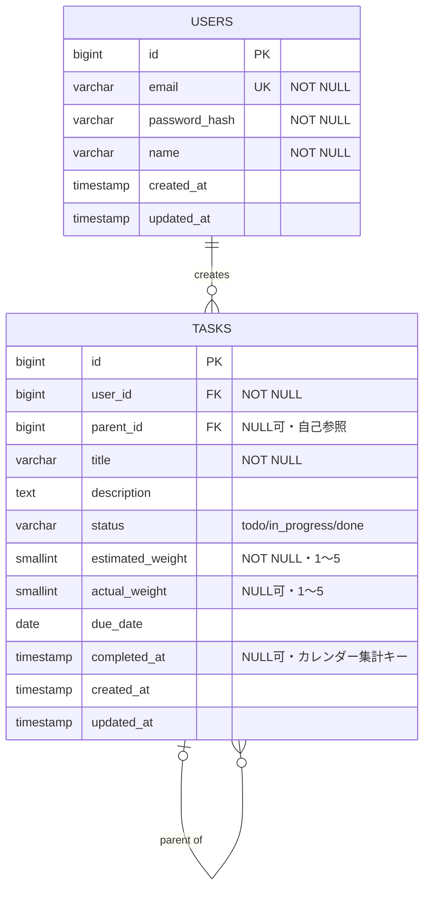

[API仕様書](#api仕様書)

[APIの概要](#apiの概要)

[共通仕様](#共通仕様)

[認証方式](#認証方式)

[ステータスコード一覧](#ステータスコード一覧)

[エンドポイント一覧](#エンドポイント一覧)

[POST /auth/register(ユーザー登録)](#post-/auth/register\(ユーザー登録\))

[POST /auth/login(ログイン)](#post-/auth/login\(ログイン\))

[GET /tasks(タスク一覧取得)](#get-/tasks\(タスク一覧取得\))

[POST /tasks(タスク作成)](#post-/tasks\(タスク作成\))

[GET /tasks/{id}(タスク詳細取得)](#get-/tasks/{id}\(タスク詳細取得\))

[PATCH /tasks/{id}(タスク更新)](#patch-/tasks/{id}\(タスク更新\))

[DELETE /tasks/{id}(タスク削除)](#delete-/tasks/{id}\(タスク削除\))

[GET /tasks/calendar](#get-/tasks/calendar)

[データベース仕様書](#データベース仕様書)

[データベース概要](#データベース概要)

[テーブル一覧](#テーブル一覧)

[users](#users)

[tasks](#tasks)

[ER図](#er図)

## API仕様書 {#api仕様書}

---

### APIの概要 {#apiの概要}

見積もり振り返り型タスク管理ツールのバックエンドAPI。ユーザー認証機能と、タスクのCRUD・親子階層管理・見積もり/実績の重さの記録・日別集計(コントリビューションカレンダー用)を提供する。対象データはusers(ユーザー)とtasks(タスク、親子関係を持つ)。

### 共通仕様 {#共通仕様}

| 項目 | 内容 |
| :---- | :---- |
| ベースURL | https://api.example.com/v1 |
| データ形式 | リクエスト/レスポンスともにapplication/json |
| 日時フォーマット | ISO 8601(例: 2026-09-09T10:00:00Z、UTC) |
| ページネーション | クエリパラメータpage(デフォルト1)・per\_page(デフォルト20、最大100) レスポンスはdata配列とmeta(total\_count, page, per\_page, total\_pages)を含む |

### 認証方式 {#認証方式}

* 方式: JWT(Bearer トークン)

```
Authorization: Bearer <access_token>
```

* パスワードはbcryptでハッシュ化して保存

### ステータスコード一覧 {#ステータスコード一覧}

| コード | 意味 |
| :---- | :---- |
| 200 OK | 取得・更新成功 |
| 201 Created | 作成成功 |
| 204 No Content | 削除成功 |
| 400 Bad Request | リクエスト形式・パラメータ不正 |
| 401 Unauthorized | 未認証・トークン無効 |
| 403 Forbidden | 他ユーザーのリソースへのアクセス |
| 404 Not Found | リソースが存在しない |
| 422 Unprocessable Entity | バリデーションエラー |
| 500 Internal Server Error | サーバー内部エラー |

認証が必要な全API(TASK-01〜06)は、上記に加えて共通で **401 Unauthorized**(トークン未指定・無効・期限切れ)を返し得る。

### エンドポイント一覧 {#エンドポイント一覧}

| No. | API ID | API名 | メソッド | エンドポイント | 認証 |
| :---- | :---- | :---- | :---- | :---- | :---- |
| 1 | AUTH-01 | ユーザー登録 | POST | /auth/register | 不要 |
| 2 | AUTH-02 | ログイン | POST | /auth/login | 不要 |
| 3 | TASK-01 | タスク一覧取得 | GET | /tasks | 必要 |
| 4 | TASK-02 | タスク作成 | POST | /tasks | 必要 |
| 5 | TASK-03 | タスク詳細取得 | GET | /tasks/{id} | 必要 |
| 6 | TASK-04 | タスク更新 | PATCH | /tasks/{id} | 必要 |
| 7 | TASK-05 | タスク削除 | DELETE | /tasks/{id} | 必要 |
| 8 | TASK-06 | 日毎に完了したタスク合計量取得 | GET | /tasks/calendar | 必要 |

### POST /auth/register(ユーザー登録) {#post-/auth/register(ユーザー登録)}

リクエストパラメータ

| 名前 | 型 | 必須 | 説明 |
| :---- | :---- | :---- | :---- |
| email | string | ○ | メールアドレス |
| password | string | ○ | パスワード(8文字以上) |
| name | string | ○ | 表示名 |

リクエスト例

```json
{
  "email": "taro@example.com",
  "password": "password123",
  "name": "太郎"
}
```

レスポンス(201)

| 名前 | 型 | 説明 |
| :---- | :---- | :---- |
| id | integer | ユーザーID |
| email | string | メールアドレス |
| name | string | 表示名 |
| created\_at | string | 作成日時 |

レスポンス例

```json
{
  "id": 1,
  "email": "taro@example.com",
  "name": "太郎",
  "created_at": "2026-09-09T10:00:00Z"
}
```

エラーレスポンス

| ステータスコード | エラーコード | エラー内容 |
| :---- | :---- | :---- |
| 422 | EMAIL\_ALREADY\_REGISTERED | メールアドレスが既に登録されている |
| 422 | VALIDATION\_ERROR | パスワードは8文字以上必要 |

### POST /auth/login(ログイン) {#post-/auth/login(ログイン)}

リクエストパラメータ

| 名前 | 型 | 必須 | 説明 |
| :---- | :---- | :---- | :---- |
| email | string | ○ | メールアドレス |
| password | string | ○ | パスワード |

リクエスト例

```json
{ "email": "taro@example.com", "password": "password123" }
```

レスポンス(200)

| 名前 | 型 | 説明 |
| :---- | :---- | :---- |
| id | integer | ユーザーID |
| access\_token | string | JWTアクセストークン |
| token\_type | string | トークン種別(常にBearer) |
| expires\_in | integer | 有効期限(秒) |

レスポンス例

```json
{
  "access_token": "eyJhbGciOiJIUzI1NiIsInR5cCI6IkpXVCJ9...",
  "token_type": "Bearer",
  "expires_in": 3600
}
```

エラーレスポンス

| ステータスコード | エラーコード | エラー内容 |
| :---- | :---- | :---- |
| 401 | INVALID\_CREDENTIALS | メールアドレスまたはパスワードが正しくない |

### GET /tasks(タスク一覧取得) {#get-/tasks(タスク一覧取得)}

リクエストパラメータ

| 名前 | 型 | 必須 | 説明 |
| :---- | :---- | :---- | :---- |
| status | string | \- | todo/in\_progress/doneで絞り込み |
| parent\_id | integer | \- | 指定した親タスクの子タスクのみ取得(未指定時は全件、null指定で親タスクのみ) |
| page | integer | \- | ページ番号 |
| per\_page | integer | \- | 1ページあたりの件数 |

レスポンス(200)

| 名前 | 型 | 説明 |
| :---- | :---- | :---- |
| id | integer | タスクID |
| parent\_id | integer/null | 親タスクのID |
| title | string | タイトル |
| description | string/null | 詳細説明 |
| status | string | ステータス(todo/in\_progress/done) |
| estimated\_weight | integer | 想定の大変さ |
| actual\_weight | integer/null | 実際の大変さ |
| due\_date | string(date)/null | 締切日 |
| completed\_at | string/null | 完了日時 |
| created\_at | string | 作成日時 |
| updated\_at | string | 更新日時 |

レスポンス例

```json
{
  "data": [
    {
      "id": 10,
      "parent_id": null,
      "title": "DevOpsキャンプ最終課題",
      "description": "タスク管理アプリを作る",
      "status": "in_progress",
      "estimated_weight": 5,
      "actual_weight": null,
      "due_date": "2026-09-20",
      "completed_at": null,
      "created_at": "2026-09-01T09:00:00Z",
      "updated_at": "2026-09-05T09:00:00Z"
    }
  ],
  "meta": { "total_count": 1, "page": 1, "per_page": 20, "total_pages": 1 }
}
```

### POST /tasks(タスク作成) {#post-/tasks(タスク作成)}

リクエストパラメータ

| 名前 | 型 | 必須 | 説明 |
| :---- | :---- | :---- | :---- |
| title | string | ○ | タスクのタイトル |
| description | string | \- | 詳細説明 |
| parent\_id | integer | \- | 親タスクのID(子タスクを作成する場合) |
| estimated\_weight | integer | ○ | 想定の大変さ(1〜5の5段階評価) |
| due\_date | string(date) | \- | 締切日 |

リクエスト例

```json
{
  "title": "ER図を作成する",
  "parent_id": 10,
  "estimated_weight": 3,
  "due_date": "2026-09-10"
}
```

レスポンス(201): GET /tasksの1件分と同じ形式のオブジェクトを返す

エラーレスポンス

| ステータスコード | エラーコード | エラー内容 |
| :---- | :---- | :---- |
| 422 | ESTIMATED\_WEIGHT\_REQUIRED | estimated\_weightが未指定 |
| 422 | INVALID\_PARENT\_ID | parent\_idが存在しない、または他ユーザーのタスク |

### GET /tasks/{id}(タスク詳細取得) {#get-/tasks/{id}(タスク詳細取得)}

レスポンス(200): GET /tasksの1件分と同じ形式(必要に応じて子タスクの一覧をchildrenとして含める)

```json
{
  "id": 10,
  "parent_id": null,
  "title": "DevOpsキャンプ最終課題",
  "status": "in_progress",
  "estimated_weight": 5,
  "actual_weight": null,
  "children": [
    { "id": 11, "title": "ER図を作成する", "status": "todo" }
  ]
}
```

エラーレスポンス

| ステータスコード | エラーコード | エラー内容 |
| :---- | :---- | :---- |
| 404 | TASK\_NOT\_FOUND | タスクが存在しない、または他ユーザーのタスク |

### PATCH /tasks/{id}(タスク更新) {#patch-/tasks/{id}(タスク更新)}

リクエストパラメータ(更新したいフィールドのみ送信)

| 名前 | 型 | 必須 | 説明 |
| :---- | :---- | :---- | :---- |
| title | string | \- | タイトル |
| description | string | \- | 詳細説明 |
| status | string | \- | todo/in\_progress/done |
| actual\_weight | integer | \- | 実際の大変さ(完了時に入力、1〜5の5段階評価) |
| due\_date | string(date) | \- | 締切日 |

リクエスト例(完了処理)

```json
{ "status": "done", "actual_weight": 4 }
```

※ `status`を`done`に更新するタイミングでサーバー側が`completed_at`に現在日時を自動設定する。

レスポンス(200): 更新後のタスクオブジェクト

エラーレスポンス

| ステータスコード | エラーコード | エラー内容 |
| :---- | :---- | :---- |
| 422 | ACTUAL\_WEIGHT\_REQUIRED | statusをdoneに更新する際にactual\_weightが未指定 |
| 404 | TASK\_NOT\_FOUND | タスクが存在しない、または他ユーザーのタスク |

---

### DELETE /tasks/{id}(タスク削除) {#delete-/tasks/{id}(タスク削除)}

レスポンス: 204 No Content(子タスクが存在する場合は子タスクも合わせて削除する)

エラーレスポンス

| ステータスコード | エラーコード | エラー内容 |
| :---- | :---- | :---- |
| 404 | TASK\_NOT\_FOUND | タスクが存在しない、または他ユーザーのタスク |

### GET /tasks/calendar {#get-/tasks/calendar}

リクエストパラメータ(クエリ)

| 名前 | 型 | 必須 | 説明 |
| :---- | :---- | :---- | :---- |
| from | string(date, YYYY-MM-DD) | \- | 集計開始日。未指定時はtoから365日前 |
| to | string(date, YYYY-MM-DD) | \- | 集計終了日。未指定時は当日 |

パラメータなしで全期間を返すと、利用が長期化した際にレスポンスサイズが線形に増えてしまうため、未指定時は直近365日分をデフォルト範囲として返す。

レスポンス(200)

| 名前 | 型 | 説明 |
| :---- | :---- | :---- |
| date | string(date) | 対象日(例: "2026-09-01") |
| total\_weight | integer | その日に完了したタスクのactual\_weightの合計値 |

レスポンス例

```json
{
  "data": [
    { "date": "2026-09-01", "total_weight": 8 },
    { "date": "2026-09-02", "total_weight": 3 }
  ]
}
```

エラーレスポンス

| ステータスコード | エラーコード | エラー内容 |
| :---- | :---- | :---- |
| 400 | INVALID\_DATE\_FORMAT | from/toがYYYY-MM-DD形式でない |
| 422 | INVALID\_DATE\_RANGE | fromがtoより後の日付になっている |

---

## データベース仕様書 {#データベース仕様書}

---

### データベース概要 {#データベース概要}

タスクごとに「想定の大変さ」と「実際の大変さ」を記録し、見積もり精度を振り返れるタスク管理ツール用のデータベース。タスクは親子(孫)の階層構造を持ち、完了時の重さを日別に集計してコントリビューションカレンダー表示に用いる。

### テーブル一覧 {#テーブル一覧}

| テーブル名 | 概要 |
| :---- | :---- |
| users | ユーザーアカウント情報 |
| tasks | タスク本体(親子・孫の階層関係、見積もり/実績の重さを保持) |

### users {#users}

ユーザーのアカウント情報を保持するテーブル。認証(ログイン)とタスクの所有者判定に使用する。

| カラム名 | 型 | 必須 | 制約 | 説明 |
| :---- | :---- | :---- | :---- | :---- |
| id | BIGINT | ○ | PK, AUTO\_INCREMENT | ユーザーID |
| email | VARCHAR(255) | ○ | UNIQUE | ログインに使用するメールアドレス |
| password\_hash | VARCHAR(255) | ○ | \- | ハッシュ化されたパスワード |
| name | VARCHAR(100) | ○ | \- | 表示名 |
| created\_at | TIMESTAMP | ○ | DEFAULT CURRENT\_TIMESTAMP | 作成日時 |
| updated\_at | TIMESTAMP | ○ | DEFAULT CURRENT\_TIMESTAMP ON UPDATE CURRENT\_TIMESTAMP | 更新日時 |

インデックス

| インデックス名 | 対象カラム | 用途 |
| :---- | :---- | :---- |
| idx\_users\_email | email | ログイン時の検索・重複防止(UNIQUE) |

### tasks {#tasks}

ユーザーが作成するタスク本体。親子(孫)の階層構造、見積もり/実績の重さ、完了日時を保持し、コントリビューションカレンダー表示の集計元データとなる。

| カラム名 | 型 | 必須 | 制約 | 説明 |
| :---- | :---- | :---- | :---- | :---- |
| id | BIGINT | ○ | PK, AUTO\_INCREMENT | タスクID |
| user\_id | BIGINT | ○ | FK → users.id | タスクの所有者 |
| parent\_id | BIGINT | \- | FK → tasks.id(自己参照) | 親タスクのID(子・孫タスクを表現) |
| title | VARCHAR(255) | ○ | \- | タスクのタイトル |
| description | TEXT | \- | \- | タスクの詳細説明 |
| status | VARCHAR(20) | ○ | DEFAULT 'todo' | ステータス('todo'/'in\_progress'/'done') |
| estimated\_weight | SMALLINT | ○ | \- | 作成時に入力する想定の大変さ(1〜5の5段階評価) |
| actual\_weight | SMALLINT | \- | \- | 完了時に入力する実際の大変さ(1〜5の5段階評価) |
| due\_date | DATE | \- | \- | 締切日 |
| completed\_at | TIMESTAMP | \- | \- | 完了日時(カレンダー集計のキー) |
| created\_at | TIMESTAMP | ○ | DEFAULT CURRENT\_TIMESTAMP | 作成日時 |
| updated\_at | TIMESTAMP | ○ | DEFAULT CURRENT\_TIMESTAMP ON UPDATE CURRENT\_TIMESTAMP | 更新日時 |

インデックス

| インデックス名 | 対象カラム | 用途 |
| :---- | :---- | :---- |
| idx\_tasks\_user\_id | user\_id | ユーザーごとのタスク一覧取得 |
| idx\_tasks\_parent\_id | parent\_id | 子・孫タスクの一覧取得 |
| idx\_tasks\_status | status | ステータス別フィルタ |
| idx\_tasks\_completed\_at | completed\_at | 日別集計(コントリビューションカレンダー表示) |

---

## ER図 {#er図}

