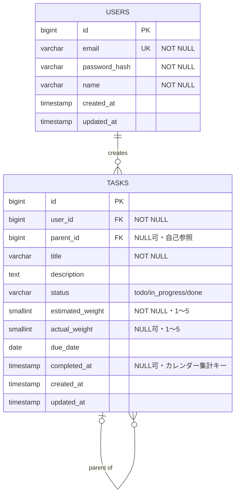

## ER図 {#er図}

テーブル定義の詳細は[DB_SPEC.md](./DB_SPEC.md)を参照。

カーディナリティは以下の通り(IE表記):

| 関係 | カーディナリティ | 説明 |
|---|---|---|
| USERS → TASKS | 1 : 0..\* | 1人のユーザーは0件以上のタスクを持つ(`tasks.user_id` → `users.id`) |
| TASKS → TASKS(自己参照) | 0..1 : 0..\* | 1つのタスクの親は0または1、子タスクは0件以上(`tasks.parent_id` → `tasks.id`) |
