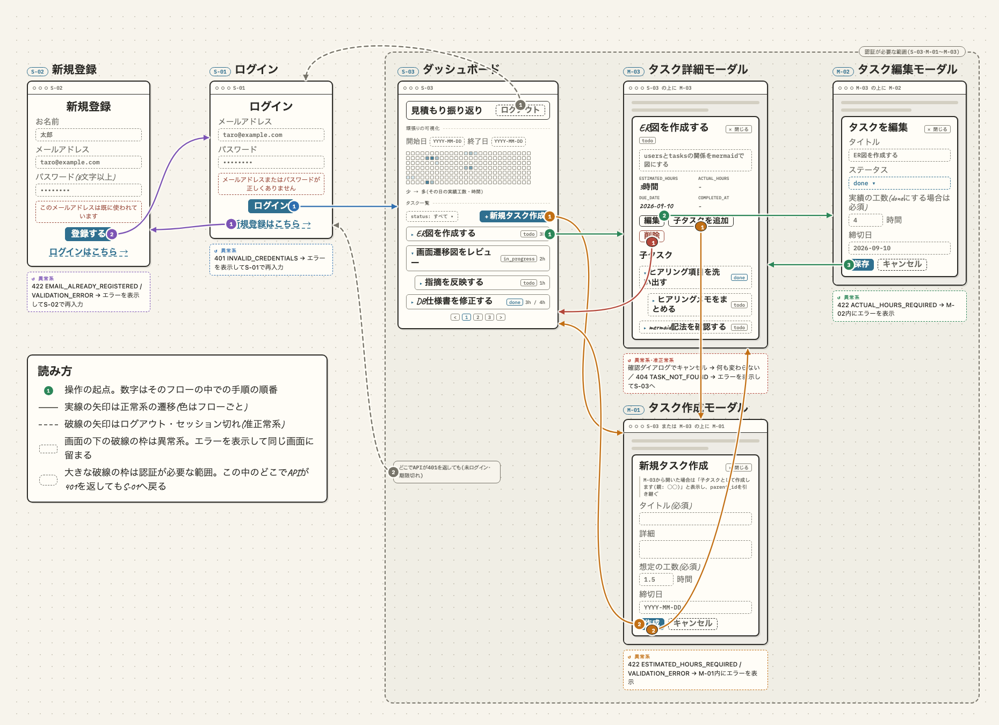
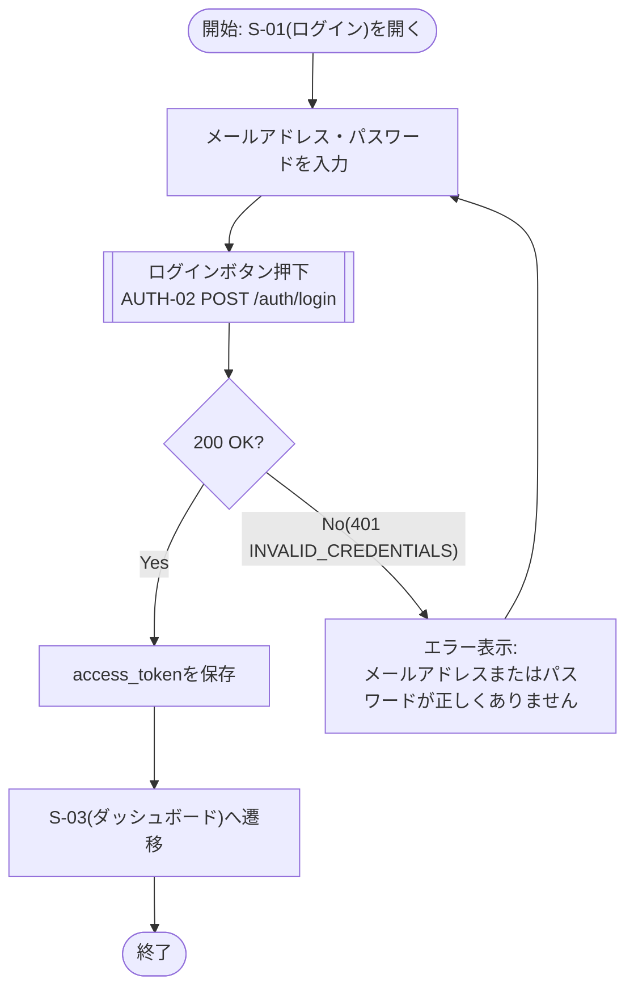
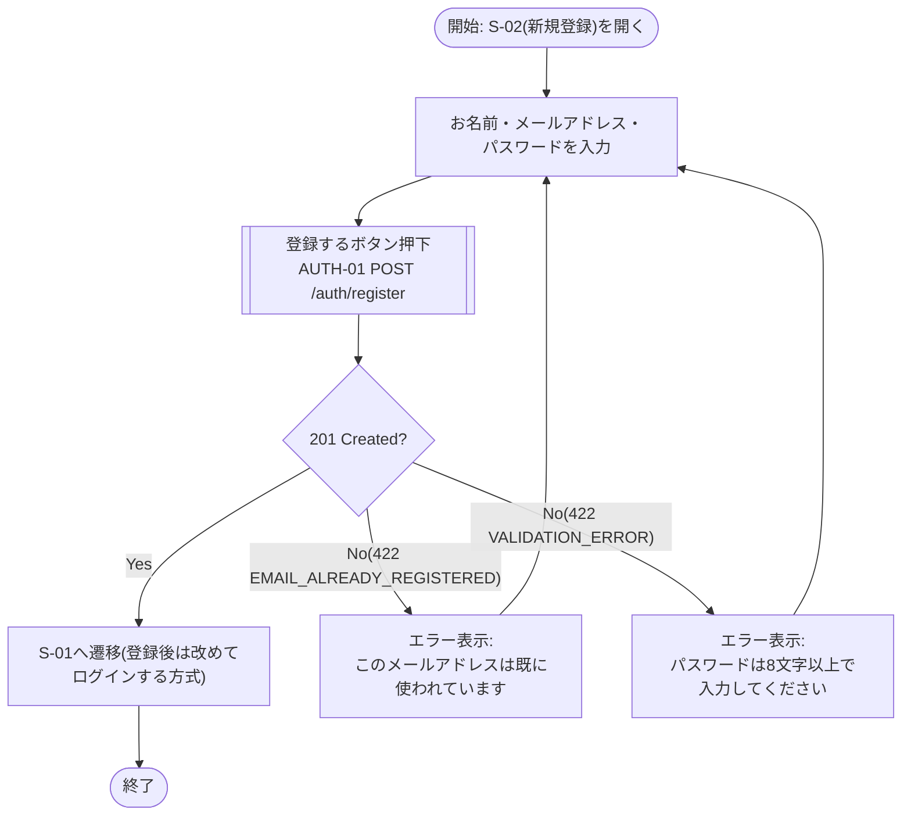
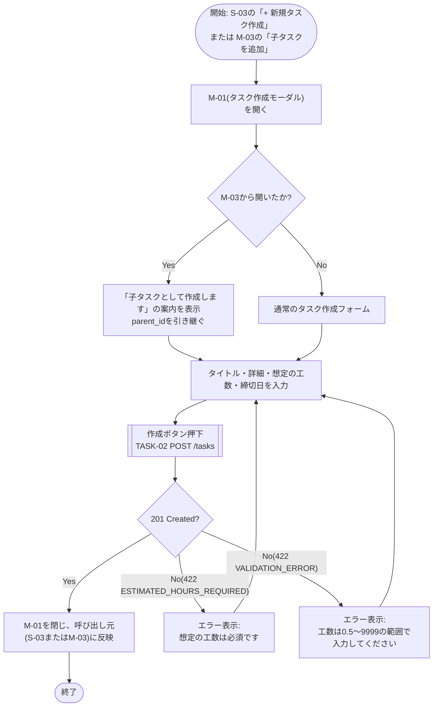
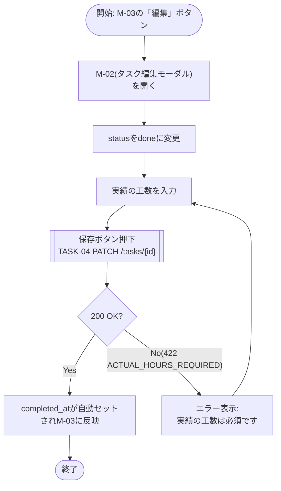
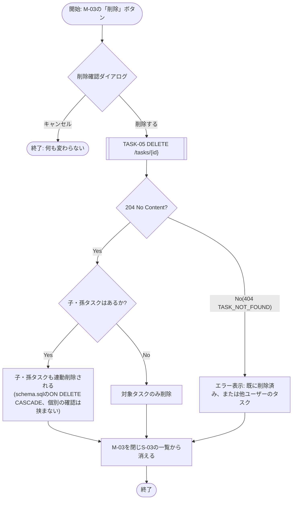

## 画面遷移図

各画面の詳細は[docs/SCREEN_LIST.md](./SCREEN_LIST.md)を参照。見た目の詳細は[ワイヤーフレーム](./design/README.md#ワイヤーフレーム)を参照(各フロー図の画面名に画面IDを併記している)。

ワイヤーフレームの各画面を並べ、ボタンから次の画面へユースケースごとに色分けした矢印でつないだ画面フローマップ。元データは[docs/design/flowmap.html](./design/flowmap.html)で、ローカルのブラウザで開くと凡例でフローを選んでそのフローだけを強調表示できる。



### 認証要否・未認証時の扱い

- `S-01`・`S-02`は認証不要。ログイン済みの状態でこれらにアクセスした場合は`S-03`へリダイレクトする(想定挙動として明記。バックエンド側では特に制御していないため、フロントエンド側のルーティングガードで実装する)
- `S-03`・`M-01`・`M-02`・`M-03`はすべて認証必要。JWTトークンを持たない状態(未ログイン、またはトークン期限切れで`401`が返ってきた場合)でアクセスすると`S-01`へリダイレクトする(詳細は下記「5. セッション切れ・未ログインアクセス」参照)
- ログアウトは専用APIを持たず、クライアント側でトークンを破棄して`S-01`へ遷移するだけで完結する([docs/SCREEN_LIST.md](./SCREEN_LIST.md)参照)。ログアウトボタンはS-03の共通ヘッダーにあり、モーダル(M-01〜M-03)表示中は背後のヘッダーを押せないため、ログアウトはS-03からのみ行う
- 一方、`401`によるS-01へのリダイレクトはS-03に限らず、M-01〜M-03でAPIを呼んだとき(作成・保存・詳細の読み込みなど)にも起こりうる
- S-03のタスク一覧、M-03の子タスク一覧における「クリックで子タスク/孫タスクを展開」操作は、同じ画面・モーダルの中でのインライン展開でありページ遷移・モーダル遷移を伴わないため、フロー図には含めていない([docs/SCREEN_LIST.md](./SCREEN_LIST.md)参照)

### ユースケース別フロー図

上の静的マップは「どの画面同士がつながっているか」は分かっても、開始・終了地点や正常系/准正常系/異常系の分岐が追いにくかった。そのため主要な6つのユースケースを、始点・終点・分岐を明示したフロー図として個別に書き起こす。各ノードには画面IDとワイヤーフレームのタブ名を併記し、エラーメッセージは実際にモックへ入れた文言をそのまま使っている。

#### 1. ログイン(正常系・異常系)



#### 2. 新規登録(正常系・異常系)



#### 3. タスク作成(正常系・異常系、親/子タスクの分岐)



#### 4. タスク完了(正常系・異常系)



#### 5. タスク削除(確認ダイアログ・子孫タスクの連動削除)



#### 6. セッション切れ・未ログインアクセス(准正常系)

```mermaid
flowchart TD
    start(["開始: S-03・M-01〜M-03のいずれかで<br/>画面表示・作成・保存などAPIを呼ぶ操作"]) --> hasToken{"トークンを保持しているか?"}
    hasToken -- No --> redirect
    hasToken -- Yes --> call[["APIを呼び出す"]]
    call --> status{"401 UNAUTHORIZED?"}
    status -- No --> show["画面を表示"]
    show --> fin1(["終了"])
    status -- Yes --> redirect["S-01へ強制リダイレクト"]
    redirect --> note["⚠ 未ログインとトークン期限切れは同じ401を返すため、<br/>フロントエンドはレスポンスだけでは区別できない<br/>(docs/assignment/step4.md「苦労したこと3.」参照)"]
    note --> fin2(["終了"])
```
