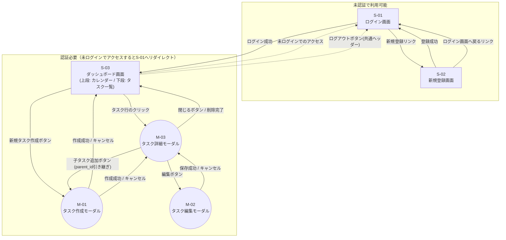

## 画面遷移図

Step4提出物。各画面の詳細は[docs/SCREEN_LIST.md](./SCREEN_LIST.md)を参照。

### 認証要否・未認証時の扱い

- `S-01`・`S-02`は認証不要。ログイン済みの状態でこれらにアクセスした場合は`S-03`へリダイレクトする(想定挙動として明記。バックエンド側では特に制御していないため、フロントエンド側のルーティングガードで実装する)
- `S-03`・`M-01`・`M-02`・`M-03`はすべて認証必要。JWTトークンを持たない状態(未ログイン、またはトークン期限切れで`401`が返ってきた場合)でアクセスすると`S-01`へリダイレクトする
- ログアウトは専用APIを持たず、クライアント側でトークンを破棄して`S-01`へ遷移するだけで完結する([docs/SCREEN_LIST.md](./SCREEN_LIST.md)参照)
- S-03のタスク一覧、M-03の子タスク一覧における「クリックで子タスク/孫タスクを展開」操作は、同じ画面・モーダルの中でのインライン展開でありページ遷移・モーダル遷移を伴わないため、この遷移図には含めていない([docs/SCREEN_LIST.md](./SCREEN_LIST.md)参照)

### 遷移トリガーの一覧

| 起点 | トリガー | 遷移先 |
| :---- | :---- | :---- |
| S-01 | ログイン成功 | S-03 |
| S-01 | 「新規登録はこちら」リンク | S-02 |
| S-02 | 登録成功 | S-01(登録後は改めてログインする方式) |
| S-02 | 「ログインはこちら」リンク | S-01 |
| S-03 | タスク行のクリック | M-03 |
| S-03 | 「新規タスク作成」ボタン | M-01(親タスクなし) |
| M-03 | 「閉じる」ボタン、または削除成功 | S-03 |
| M-03 | 「子タスクを追加」ボタン | M-01(親タスクIDを引き継ぐ) |
| M-03 | 「編集」ボタン | M-02 |
| M-01 | 作成成功 / キャンセル | 呼び出し元(S-03 または M-03) |
| M-02 | 保存成功 / キャンセル | M-03 |
| S-03 | 共通ヘッダー「ログアウト」ボタン | S-01 |
| S-03 | 未ログイン状態でのアクセス(直接URL遷移等) | S-01 |