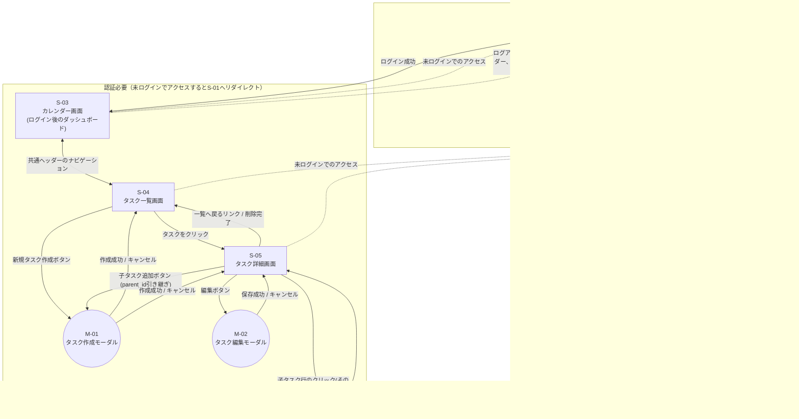

## 画面遷移図

Step4提出物。各画面の詳細は[docs/SCREEN_LIST.md](./SCREEN_LIST.md)を参照。

### 認証要否・未認証時の扱い

- `S-01`・`S-02`は認証不要。ログイン済みの状態でこれらにアクセスした場合は`S-03`へリダイレクトする(想定挙動として明記。バックエンド側では特に制御していないため、フロントエンド側のルーティングガードで実装する)
- `S-03`〜`S-05`・`M-01`・`M-02`はすべて認証必要。JWTトークンを持たない状態(未ログイン、またはトークン期限切れで`401`が返ってきた場合)でアクセスすると`S-01`へリダイレクトする
- ログアウトは専用APIを持たず、クライアント側でトークンを破棄して`S-01`へ遷移するだけで完結する([docs/SCREEN_LIST.md](./SCREEN_LIST.md#設計の考え方)参照)

### 遷移トリガーの一覧

| 起点 | トリガー | 遷移先 |
| :---- | :---- | :---- |
| S-01 | ログイン成功 | S-03 |
| S-01 | 「新規登録はこちら」リンク | S-02 |
| S-02 | 登録成功 | S-01(登録後は改めてログインする方式) |
| S-02 | 「ログインはこちら」リンク | S-01 |
| S-03 | 共通ヘッダー「タスク一覧」リンク | S-04 |
| S-04 | 共通ヘッダー「カレンダー」リンク | S-03 |
| S-04 | タスク行のクリック | S-05 |
| S-04 | 「新規タスク作成」ボタン | M-01(親タスクなし) |
| S-05 | 「一覧へ戻る」リンク、または削除成功 | S-04 |
| S-05 | 子タスク行のクリック | S-05(その子タスクのID) |
| S-05 | 「子タスクを追加」ボタン | M-01(親タスクIDを引き継ぐ) |
| S-05 | 「編集」ボタン | M-02 |
| M-01 | 作成成功 / キャンセル | 呼び出し元(S-04 または S-05) |
| M-02 | 保存成功 / キャンセル | S-05 |
| S-03/S-04/S-05 | 共通ヘッダー「ログアウト」ボタン | S-01 |
| S-03/S-04/S-05 | 未ログイン状態でのアクセス(直接URL遷移等) | S-01 |