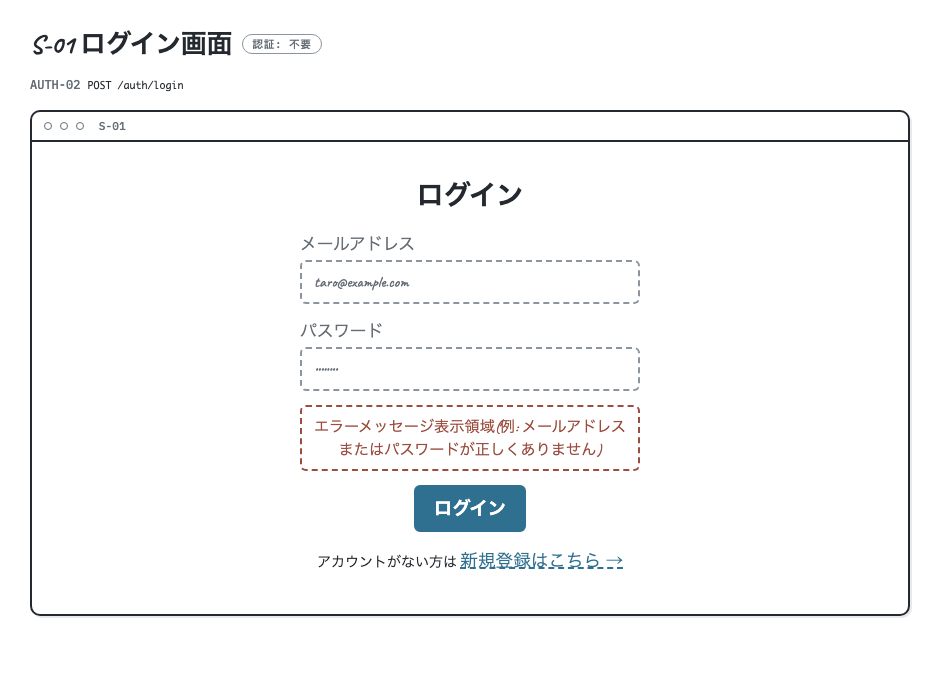
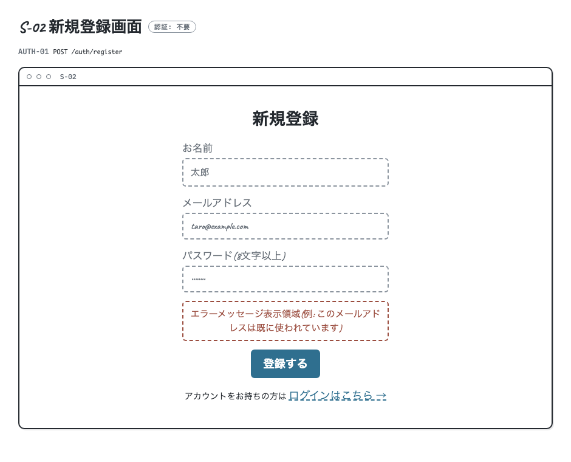
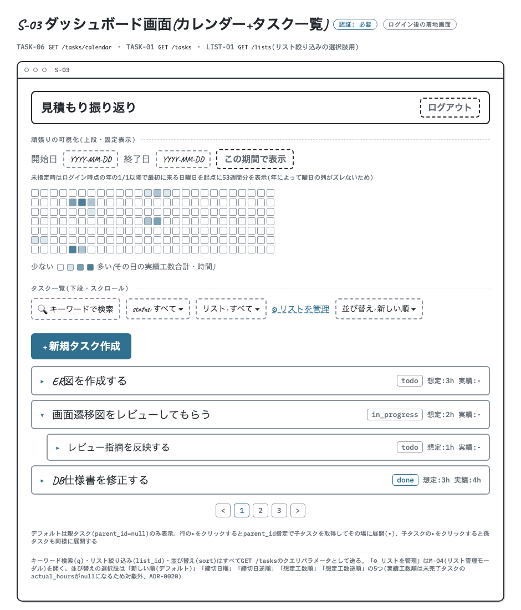
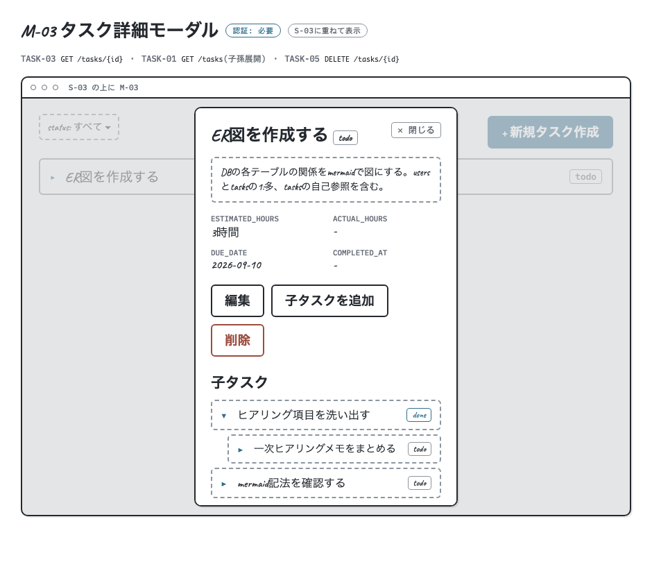
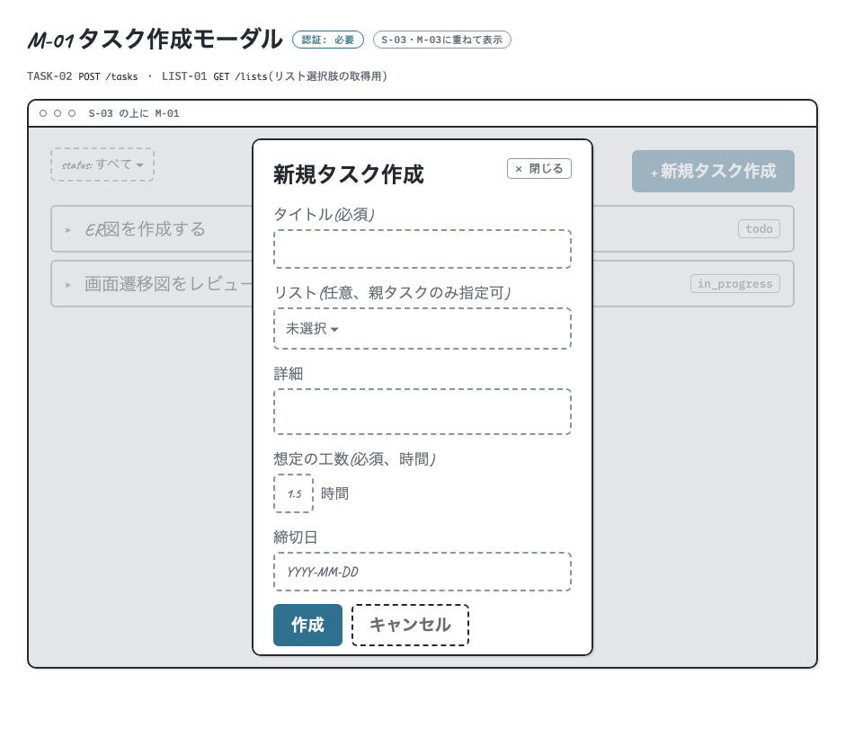
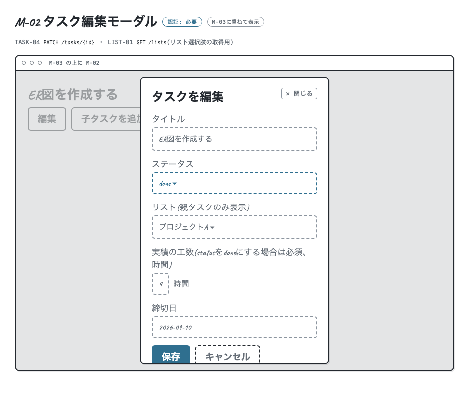

## 画面一覧

Step4提出物。バックエンドAPI([docs/API_SPEC.md](./API_SPEC.md))に対応する画面を洗い出したもの。タスクの作成・編集・詳細確認はすべてモーダル方式(ダッシュボード画面の上に重ねて表示)とし、ページ遷移を最小限にしている。ログイン後のダッシュボード画面は、カレンダー(ヒートマップ)とタスク一覧を1画面に統合した構成とした(アプリのテーマである「頑張りの可視化」と「今やるべきことの確認」を同時に見せるため)。

画面遷移そのものは[docs/SCREEN_FLOW.md](./SCREEN_FLOW.md)を参照。

### S-01: ログイン画面

| 項目 | 内容 |
| :---- | :---- |
| 目的・機能 | 登録済みユーザーがメールアドレス・パスワードでログインする |
| 主要なUI要素/入力項目 | email入力欄、password入力欄、ログインボタン、新規登録画面へのリンク、エラーメッセージ表示領域 |
| 対応するAPIエンドポイント | AUTH-02(`POST /auth/login`) |
| 認証要否 | 不要 |

### S-02: 新規登録画面

| 項目 | 内容 |
| :---- | :---- |
| 目的・機能 | 新しいユーザーアカウントを作成する |
| 主要なUI要素/入力項目 | email入力欄、password入力欄(8文字以上)、name入力欄、登録ボタン、ログイン画面へのリンク、エラーメッセージ表示領域 |
| 対応するAPIエンドポイント | AUTH-01(`POST /auth/register`) |
| 認証要否 | 不要 |

### S-03: ダッシュボード画面(カレンダー+タスク一覧)

ログイン後のダッシュボード画面。当初はカレンダー(S-03)とタスク一覧(S-04)を別画面にしていたが、両方とも「ログインしたらまず見たい情報」であるため1画面に統合した。上段にヒートマップを固定表示し、下段にタスク一覧を配置するレイアウトとする。

| 項目 | 内容 |
| :---- | :---- |
| 目的・機能 | (上段)完了タスクの工数を日別に集計し、GitHubのコントリビューションカレンダー風に可視化する。見積もりと実績の振り返りの起点。(下段)自分のタスクを一覧・絞り込み・ページングして確認する。新規タスク作成の起点 |
| 主要なUI要素/入力項目 | **上段(固定表示)**: 日別ヒートマップ(工数に応じた濃淡表示)、期間選択(from/to、未指定時は当年1/1以降で最初の日曜日から53週間)。**下段(スクロール)**: タスクカード一覧(タイトル・ステータス・想定/実績の工数)、デフォルトは親タスク(`parent_id=null`)のみ表示、親タスク行クリックで子タスクを展開(`parent_id=親のID`で再取得)、子タスク行クリックで孫タスクをさらに展開、statusフィルタ、ページネーションコントロール、「新規タスク作成」ボタン(→M-01)。共通ヘッダー(ログアウトボタン) |
| 対応するAPIエンドポイント | TASK-06(`GET /tasks/calendar`)、TASK-01(`GET /tasks`) |
| 認証要否 | 必要 |

### M-03: タスク詳細モーダル

S-03のタスク行をクリックすると開く、S-03の上に重ねて表示するモーダル。画面遷移を発生させずにタスク詳細を確認できるようにするため、独立した画面(旧S-05)ではなくモーダルとして設計している。モーダル内の子タスク行をクリックすると、S-03のタスク一覧と同じ「クリックで1階層ずつ展開」方式でその場にインライン展開し(`GET /tasks?parent_id=子タスクのID`)、孫タスク以下もモーダルを閉じずに辿っていける。

| 項目 | 内容 |
| :---- | :---- |
| 目的・機能 | 1件のタスクの詳細(子タスク含む)を確認し、編集・削除・子タスク追加を行う |
| 主要なUI要素/入力項目 | タイトル・詳細・ステータス・想定/実績の工数・締切日・完了日時の表示、子タスク一覧(行クリックでその子タスクの下に孫タスクをインライン展開、さらにクリックで曾孫タスクも同様に展開)、「編集」ボタン(→M-02)、「子タスクを追加」ボタン(→M-01)、「削除」ボタン(確認ダイアログ経由)、閉じるボタン |
| 対応するAPIエンドポイント | TASK-03(`GET /tasks/{id}`)、TASK-01(`GET /tasks`、子タスク展開時の`parent_id`フィルタ用)、TASK-05(`DELETE /tasks/{id}`) |
| 認証要否 | 必要 |

### M-01: タスク作成モーダル

S-03・M-03の上に重ねて表示するモーダル。M-03から開いた場合は子タスク作成として`parent_id`が引き継がれる。

| 項目 | 内容 |
| :---- | :---- |
| 目的・機能 | 新規タスク(または子タスク)を作成する |
| 主要なUI要素/入力項目 | title入力(必須)、description入力、estimated_hours入力(時間単位の小数、0.5刻み、必須)、due_date入力、作成ボタン、キャンセルボタン |
| 対応するAPIエンドポイント | TASK-02(`POST /tasks`) |
| 認証要否 | 必要 |

### M-02: タスク編集モーダル

M-03の上に重ねて表示するモーダル。完了処理(`status`を`done`に変更)もここで行う。

| 項目 | 内容 |
| :---- | :---- |
| 目的・機能 | 既存タスクの内容編集、ステータス変更(完了処理含む) |
| 主要なUI要素/入力項目 | title/description/due_date編集欄、statusセレクト(todo/in_progress/done)、actual_hours入力(時間単位の小数、0.5刻み、statusをdoneにする場合必須)、保存ボタン、キャンセルボタン |
| 対応するAPIエンドポイント | TASK-04(`PATCH /tasks/{id}`) |
| 認証要否 | 必要 |

